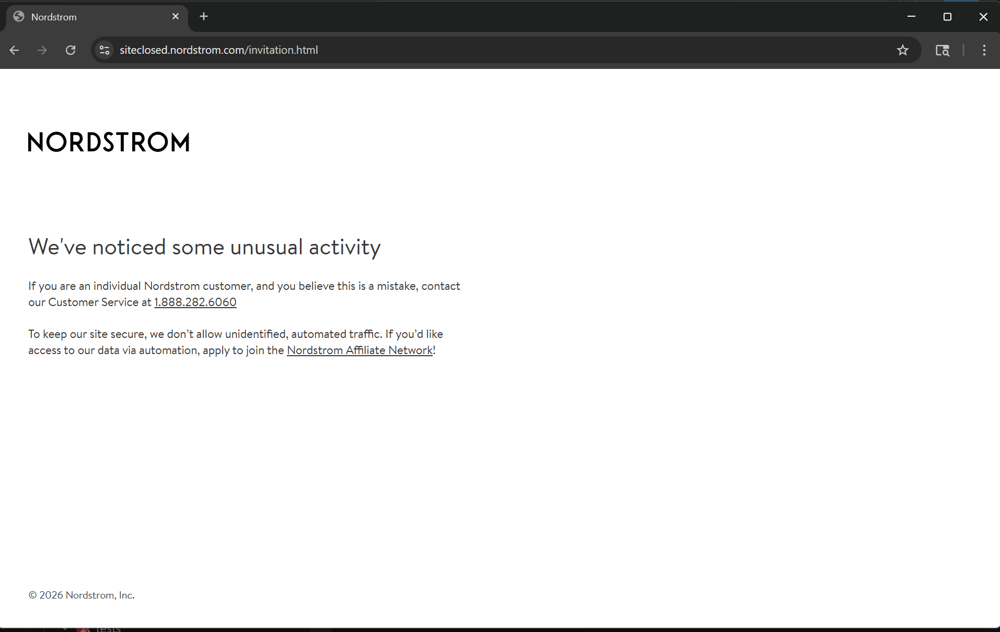
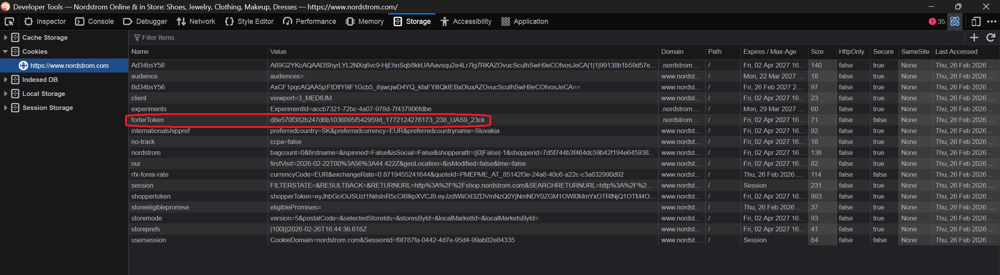

# 🛍️ Nordstrom Stealth Scraper


An advanced, asynchronous web scraper built with Python. This project is specifically designed to bypass enterprise-level anti-fraud and anti-bot systems to successfully extract normalized product data from Nordstrom.com.

## 🛡️ The Challenge: Enterprise Anti-Bot Protection

Nordstrom uses strict Web Application Firewalls (WAF) and behavioral analysis systems (like **Forter**) to block automated traffic. 

If you try to scrape the site using standard automation tools (Requests, Selenium, or vanilla Playwright), the behavioral fingerprinting catches you instantly and redirects to a penalty page:

 
*(Standard Playwright instance blocked by Nordstrom's anti-bot system).*

By inspecting the connection, we can confirm the presence of enterprise behavioral tracking via the `forterToken`:



## ✅ The Solution: Stealth Bypass & Clean Architecture

This project uses **Camoufox** (a stealth browser extension for Playwright) combined with human-like interaction patterns. It successfully spoofs WebGL, Canvas, and Audio fingerprints, forcing the anti-fraud systems to issue valid tracking cookies.


*(Successfully bypassing the protection, passing all Pytest mocks, and scraping the data).*

### 🏗️ Tech Stack & Architecture
This project strictly follows **Clean Architecture** principles to ensure maintainability:
* **Domain:** Pydantic models for strict data validation.
* **Scraping Layer:** Playwright + Camoufox (Async), using the Factory Pattern for browser context management.
* **Database:** DuckDB for fast, serverless analytical data storage (Repository Pattern).
* **Testing:** Pytest with full mocking of the browser and database layers.

## 🚀 How to Run

**1. Clone & Install:**
```bash
git clone https://github.com/youngboy21178/StealthScraperNordstorm.git
cd StealthScraperNordstorm
python -m venv .venv
.venv\Scripts\activate
pip install -r requirements.txt
```


**2. Run the Scraper (includes Pytest check):

```bash
.\app\start.bat
```

**3. View the Normalized Data:


```bash
python scripts/show_db.py
```

Disclaimer: This project is for educational purposes only to demonstrate advanced web scraping, fingerprint spoofing, and software architecture concepts.
